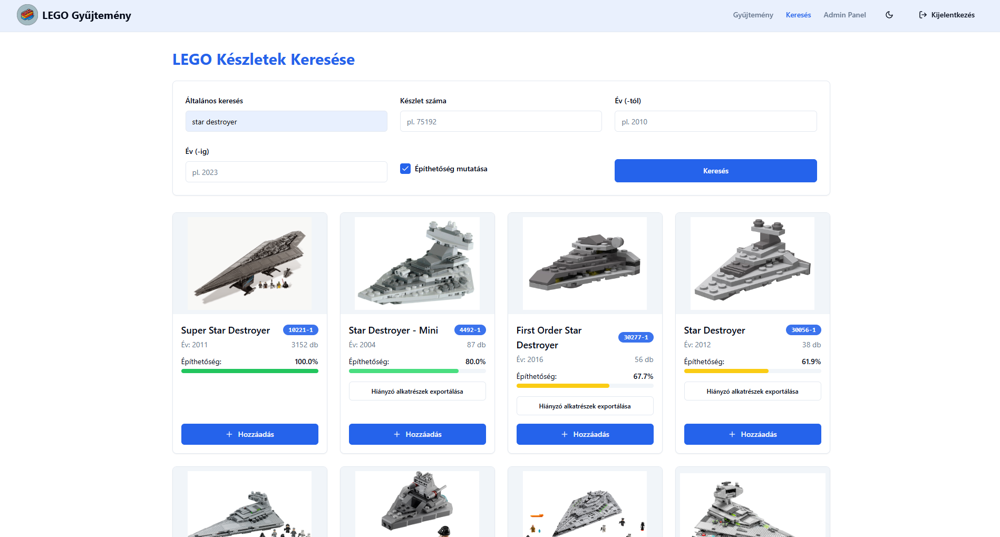
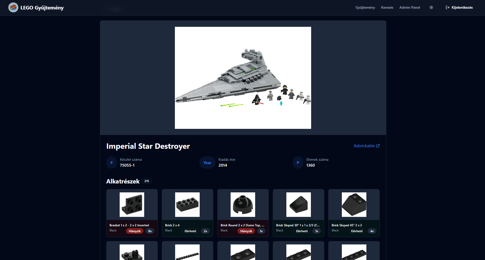
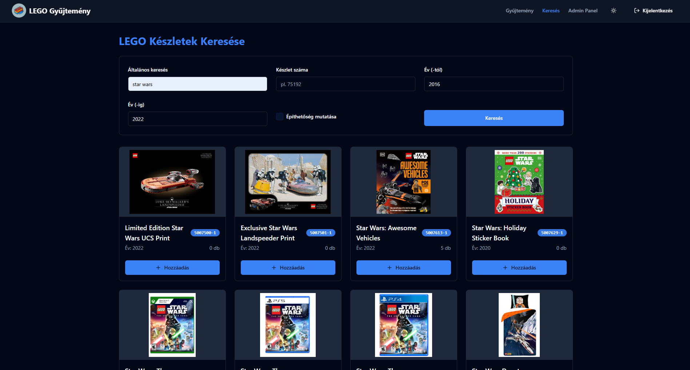
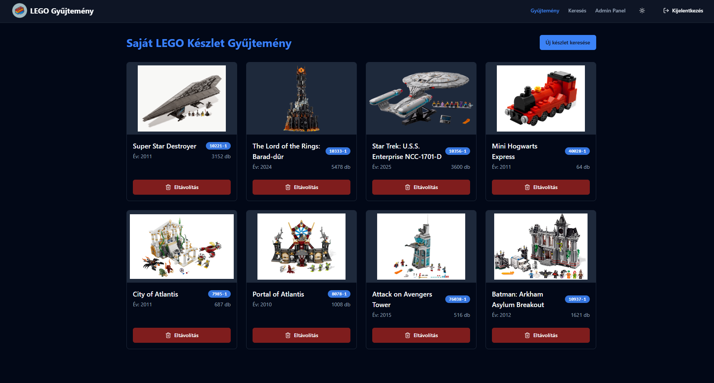
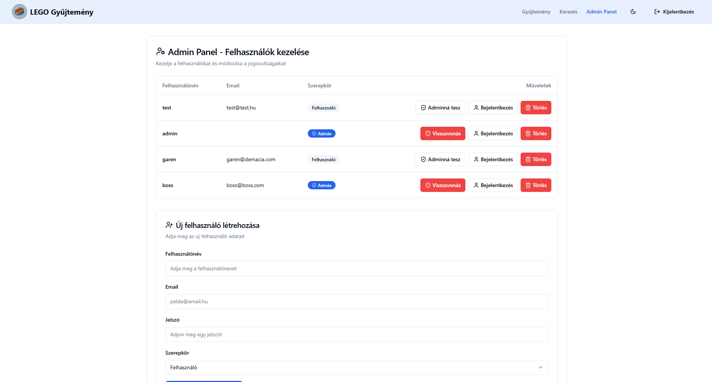
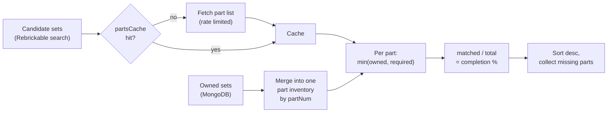
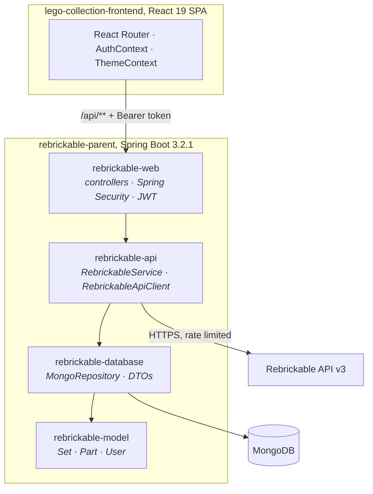

# Rebrickable API Manager

LEGO set collection manager. Spring Boot backend proxying the [Rebrickable API v3](https://rebrickable.com/api/v3), collections in MongoDB, React SPA on top.


The main endpoint is `GET /api/rebrickable/sets/buildable`. It merges the parts of every set you own into a single inventory, scores catalogue sets against it, and ranks them by completion.

> The UI is in Hungarian, the project was submitted as a university thesis. Code, API and docs are in English.

---

## Screenshots



<table>
<tr>
<td width="50%"></td>
<td width="50%"></td>
</tr>
<tr>
<td align="center">Set details, parts marked owned or missing.</td>
<td align="center">Search by name, set number or year range.</td>
</tr>
<tr>
<td width="50%"></td>
<td width="50%"></td>
</tr>
<tr>
<td align="center">Own collection.</td>
<td align="center">Admin panel, light theme.</td>
</tr>
</table>

---

## Features

- **Search:** name, set number, year range, server-side pagination.
- **Collection:** claim a set as owned, stored per user in MongoDB.
- **Buildable sets:** completion percentage per set plus a missing-parts list, CSV exportable.
- **Auth:** stateless JWT, BCrypt hashing, `USER` / `ADMIN` roles, admin panel with user CRUD and impersonation.
- **API client:** 1 req/sec rate limiting, retry on HTTP 429 using `Retry-After`, in-memory part cache.

---

## Buildable-sets algorithm

`RebrickableService.getBuildableSets`:



This is not a set intersection. Quantities count: three 2×4 bricks do not cover a requirement for eight. Each part contributes `min(owned, required)`, completion is `matchedParts / totalParts`, and the same loop collects what is missing and how many.

Every candidate set costs one upstream request, and the API allows roughly one per second. Part lists are cached in a `ConcurrentHashMap` on the service instance to keep that count down.

---

## Architecture

Four Maven modules, each depending on the previous one, plus a separate React SPA.



| Module | Contents |
|---|---|
| `rebrickable-model` | MongoDB `@Document` entities. Jackson `@JsonProperty` maps Rebrickable's `snake_case` onto camelCase fields. |
| `rebrickable-database` | `MongoRepository` interfaces, response and DTO types. |
| `rebrickable-api` | `RebrickableApiClient` (outbound HTTP, rate limiting, retry, API key stripping) and `RebrickableService` (business logic, caching, buildable-sets computation). |
| `rebrickable-web` | Entry point, REST controllers, Spring Security configuration, JWT filter. |

### Security

`JwtAuthenticationFilter` runs before `UsernamePasswordAuthenticationFilter` and fills the `SecurityContext` from the `Authorization` header. Public paths are `/api/auth/register`, `/api/auth/login` and the static assets. `/api/admin/**` needs `ROLE_ADMIN`, everything else needs authentication.

Controllers take the username from the `SecurityContext` rather than a request parameter. Editing the URL will not get you someone else's collection. No endpoint returns the `User` entity either; `UserResponse` is the projection that keeps the BCrypt hash on the server.

Rebrickable echoes the API key back in the `next`/`previous` links of every response. `RebrickableApiClient.withoutApiKey` strips it before anything is logged or returned to the browser.

---

## Getting started

Needs JDK 21, Node.js 18+, Docker (for MongoDB) and a [Rebrickable API key](https://rebrickable.com/api/).

### 1. Configuration

`application.properties` is committed and holds no secrets, only `${ENV_VAR}` placeholders. Values are read at startup. Changing one needs a restart.

| Variable | Required | Default |
|---|:---:|---|
| `REBRICKABLE_API_KEY` | yes | - |
| `JWT_SECRET` | yes | - (min. 32 characters, HMAC-SHA256) |
| `JWT_EXPIRATION` | no | `86400000` (24 h) |
| `MONGODB_URI` | no | `mongodb://localhost:27017/rebrickable` |

```bash
export REBRICKABLE_API_KEY="your-key-here"
export JWT_SECRET="a-string-of-at-least-thirty-two-characters"
```

### 2. MongoDB and backend

```bash
docker compose up -d mongo                      # MongoDB 7 on :27017

cd rebrickable-parent
./mvnw clean install                            # build all four modules
./mvnw -pl rebrickable-web spring-boot:run      # API on http://localhost:8080
```

On Windows use `mvnw.cmd` and clone with `git clone -c core.longpaths=true`.

### 3. Frontend

```bash
cd lego-collection-frontend
npm ci
npm start                                       # http://localhost:3000
```

The CRA dev server proxies `/api` to `localhost:8080`. No CORS setup needed.

### First admin

Registration always gives the `USER` role. Promote the first account in MongoDB, then use the admin panel:

```js
db.users.updateOne({ username: "you" }, { $set: { role: "ADMIN" } })
```

Log out and back in afterwards, the role is carried in the token and in `localStorage`.

---

## API reference

Everything except `/api/auth/**` needs an `Authorization: Bearer <token>` header.

<details>
<summary><strong>Auth:</strong> <code>/api/auth</code></summary>

| Method | Path | Description |
|---|---|---|
| `POST` | `/register` | Create an account. Returns the user without the password hash. Role is always `USER`. |
| `POST` | `/login` | Returns `{ token, role, username }`, `ROLE_` prefix stripped. |

</details>

<details>
<summary><strong>Sets and search:</strong> <code>/api/rebrickable</code></summary>

| Method | Path | Description |
|---|---|---|
| `GET` | `/sets/search` | Params: `query`, `setNum`, `name`, `yearFrom`, `yearTo`, `page`, `pageSize`. Pagination links point back at this endpoint. |
| `GET` | `/sets/{setNum}` | Details of one set. |
| `GET` | `/sets/{setNum}/parts` | Paginated part list. |
| `GET` | `/sets/buildable` | Same filters as search, plus completion percentage and missing parts. |
| `POST` | `/sets` | Persist a set locally. |

</details>

<details>
<summary><strong>Collection:</strong> <code>/api/user/collection</code></summary>

| Method | Path | Description |
|---|---|---|
| `GET` | `/api/user/collection` | Sets owned by the authenticated user. |
| `PUT` | `/api/user/collection/{setNum}?owned=true\|false` | Claim or release a set. |

</details>

<details>
<summary><strong>Admin:</strong> <code>/api/admin</code>, requires <code>ROLE_ADMIN</code></summary>

| Method | Path | Description |
|---|---|---|
| `GET` | `/users` | List users, hashes excluded. |
| `POST` | `/create` | Create a user. `409` if the username is taken. |
| `DELETE` | `/users/{id}` | Delete a user. |
| `POST` | `/promote/{id}` · `/revoke/{id}` | Grant or remove `ADMIN`. |
| `POST` | `/impersonate/{id}` | Issue a token for another user. |

</details>

---

## Tests

63 tests: unit tests for the model and DTO layers, Mockito controller tests, `@WebMvcTest` slices for auth and admin, and a full-context test for the security configuration.

```bash
cd rebrickable-parent

./mvnw test                                     # everything, needs MongoDB running

# everything except the repository tests, no infrastructure needed
./mvnw test -Dtest='!*RepositoryTest' -Dsurefire.failIfNoSpecifiedTests=false
```

Only the three `*RepositoryTest` classes use a real MongoDB.

---

## Attribution

Set and part data comes from [Rebrickable](https://rebrickable.com/).

LEGO® is a trademark of the LEGO Group, which does not sponsor or endorse this project.
